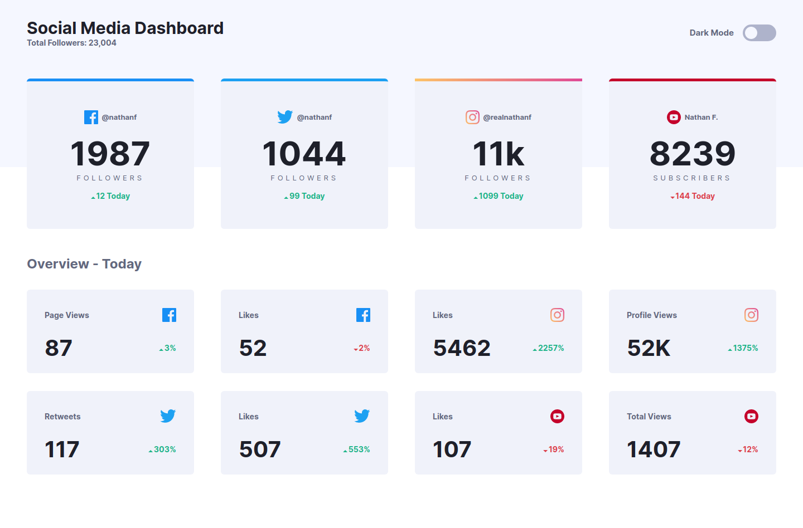
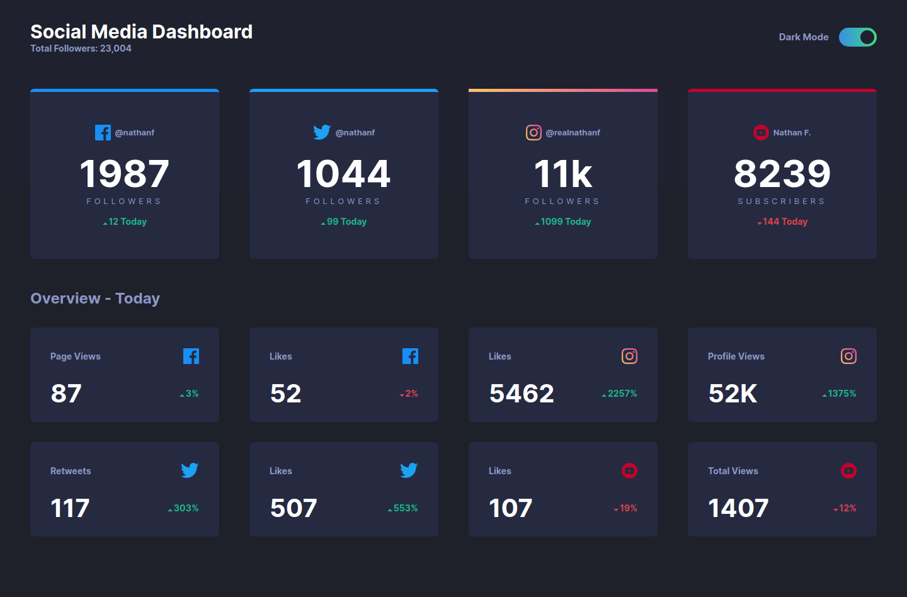
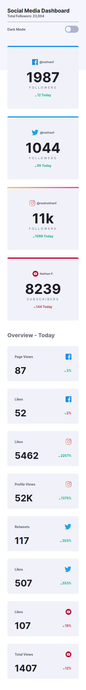
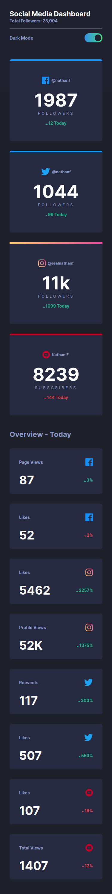

# Frontend Mentor - Social media dashboard with theme switcher solution

This is a solution to the [Social media dashboard with theme switcher challenge on Frontend Mentor](https://www.frontendmentor.io/challenges/social-media-dashboard-with-theme-switcher-6oY8ozp_H). Frontend Mentor challenges help you improve your coding skills by building realistic projects.

## Table of contents

- [Overview](#overview)
  - [The challenge](#the-challenge)
  - [Screenshot](#screenshot)
  - [Links](#links)
- [My process](#my-process)
  - [Built with](#built-with)
  - [What I learned](#what-i-learned)
  - [Useful resources](#useful-resources)
- [Author](#author)

## Overview

### The challenge

Users should be able to:

- View the optimal layout for the site depending on their device's screen size
- See hover states for all interactive elements on the page
- Toggle color theme to their preference

### Screenshot

### Links

- Solution URL: [Github URL here](https://github.com/atorres-io/frontend-mentor-social-media-dashboard)
- Live Site URL: [Live Site URL here](https://frosty-brown-faa722.netlify.app)

## My process

### Built with

- Semantic HTML5 markup
- CSS custom properties
- Sass (SCSS)
- Vanilla JavaScript (ES6)
- CSS animations
- Flexbox
- BEM methodology
- ITCSS architecture

### What I learned

I have improved in the more conscious use of the layout organization.

### Useful resources

[Sass Guide](https://sass-lang.com/guide) - I needed to refresh certain uses of sass.

## Author

- Instagram - [@atorres.designs](https://www.instagram.com/atorres.designs/)
- Frontend Mentor - [@atorres-io](https://www.frontendmentor.io/profile/atorres-io)
- Github - [@atorres-io](https://github.com/atorres-io)
- Codepen - [@atorres-designs](https://codepen.io/atorres-designs)
- LinkedIn - [@atorresalcala](https://www.linkedin.com/in/atorresalcala)
